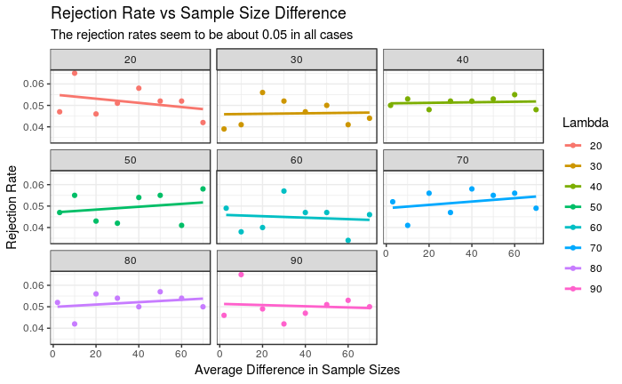

```{r setup, include=FALSE}
knitr::opts_chunk$set(echo = TRUE)
```


# Introduction

The Wilcoxon Rank Sum Test is a a non-parametric Test that is used to test if samples come from the same distribution by testing if they have the same centers (usually median). The hypothesis of the tests are:

$ H_0 $: The two populations have the same distribution.
$ H_1 $: The two populations from different distributions.

### Assumptions:
  1. It Assumes that the observations are independent.
  2. The two populations have equal spread or Variance.
  
# Motivation

My interest was to investigate the relationship between rejection rates and the power of the Wilcoxon Rank Sum Test for different sample sizes. I did this by dividing my study into two parts. First, I investigated this relationship for cases in which the population distributions are symmetric. Then I investigated the case where the population distributions non-symmetric. In both cases, a fundamental distribution that I used was the Poisson distribution. This was to ensure that the assumption of equal spread was satistfied. The questions that I attempted to answer are as follows:

  1. How does symmetry of the population distribution relate to the rejection rates of the test?
  2. How does the difference in sample size affect the rejection rate?
  3. For non-symmetric distribution, how does the difference in sample sizes affect the power of the test.
  


# Results

The rejection rates seem to be approximately uniform for the different sizes of lambda for most of the various values of differences in sample sizes. This may show that the difference in sample sizes may not(subject to further investiigation) a significant effect on the rejection rate of the wilcoxon Rank sum test.This can be said of samples that are taken from the same symmetric( $\lambda \ge 20$) population. In order naively infer this observation to other symmetric distributions, I will use another symmetric distribution to investigate this observation

```{r echo=FALSE, out.width='100%'}

```


# References

1. University of Virginia Library : data.library.virginia.edu/the-wilcoxon-rank-sum-test